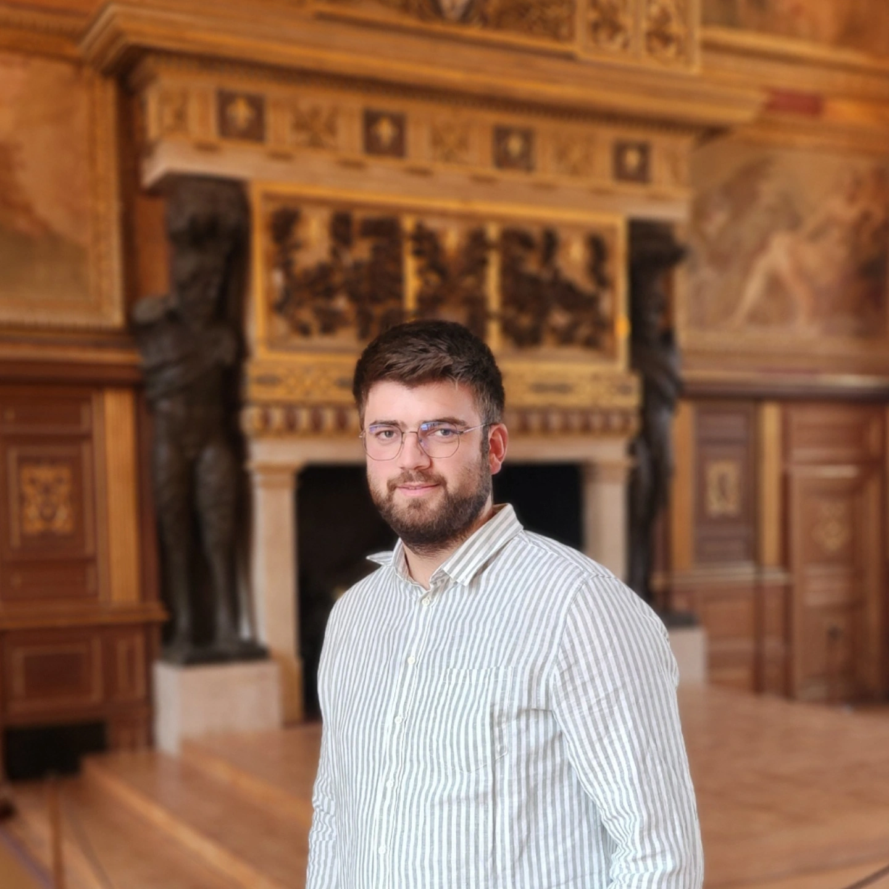

<html lang="en">
<head>
  

</head>
<body>
  

    <!-- Left side: content -->
    

      
<strong>Email:</strong> vladimir.boskovic at ipht dot fr

      

        
I am a PhD student at <a href="https://www.ipht.fr/en/">IPhT Paris-Saclay</a> supervised by <a href="https://www.normalesup.org/~ramassamy/index.html.en">Sanjay Ramassamy</a> and <a href="https://perso.lpsm.paris/~boutillier/">Cédric Boutillier</a> . I am working on combinatorial and geometric aspects of the non-bipartite dimer model. Besides that, I am also interested in extremal combinatorics, in particular saturation problems for various ordered structures.

      

      

        <h2>Preprints</h2>
        <ul>
          <li>Vladimir Bošković, Balázs Keszegh: Saturation of edge-ordered graphs, <a href="https://arxiv.org/abs/2408.00457">arXiv:2408.00457</a>, 2024.</li>
        </ul>
      

      

        <h2>Publications</h2>
        <ul>
          <li>Vladimir Bošković, Balázs Keszegh: Saturation of Ordered Graphs, SIAM J. Discrete Math., 37(2):1118-1141, 2023.<a href="https://arxiv.org/abs/2203.05307">arXiv</a></li> 
        </ul>
      

      

        <h2>Talks</h2>
        <ul>
          <li>42 years of Alternating Sign Matrices, Ljubljana, September 2025.</li>
          <li>Combinatorics Seminar, Rényi Institute, Budapest, September 2025.</li>
          <li>Séminaire des doctorants, Institut de Mathématique d’Orsay, June 2025.</li>
          <li>Seminar Series, Institute for Pure and Applied Mathematics, Los Angeles, May 2024.</li>
        </ul>
      

      

        <h2>Teaching</h2>
        <ul>
          <li>Introduction to Probability (L2 Sorbonne Université), teaching assistant, January - May 2025.</li>
        </ul>
      

    

    <!-- Right side: profile picture -->
    

      
    

  

</body>
</html>
